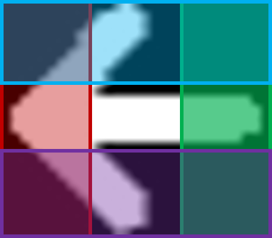
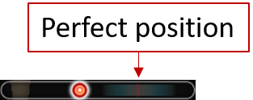
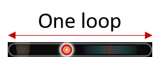
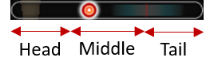

# Auto Audition Game Hacker

Auto play Audition game by using basic image processing techniques.

This project was done in 2 days for the purpose of killing my time.

Commercializing this project is prohibited and illegal.

## Results

## How it works?

Firstly, the game window will be scanned by using
[python-mss](https://github.com/BoboTiG/python-mss).

Secondly, the region of keys (arrows) and the perfect area
(the area which has the running marker) will be cropped.
These regions are in fixed positions.

    
     
    

Finally, some tricky image processing algorithms will be performed
on the keys area to detect the keys.
Simultaneously, some algorithms will also be applied on the perfect area
to detect the time when we should hit Ctrl (to hit perfect).

### Key detection

From the keys area image, I threshold it to get the arrows only.
Then the contour detection algorithm will help us to find those separated arrows.
I sort the contours to make it sequential from left to right.
Now I have each key separated as a ROI (region of interest)
by getting the bounding boxes of those contours.

    
     
    

For each ROI (bounding box of key's contour) as below, I split it into 4 regions
red, blue, green and purple. The region that has the highest amount of white pixels
will contain the arrow's head.

    

For the blue/red key, I convert the original RGB image into HSV color space then
just apply [this trick](https://docs.opencv.org/trunk/df/d9d/tutorial_py_colorspaces.html)
to detect whether this ROI is blue-ish or red-ish.

### Perfect detection

There are 2 main tasks here. The first one is to detect the marker position.
The other one is to measure the time we need to hit Ctrl.

For the first task, I use [template matching algorithm](https://opencv-python-tutroals.readthedocs.io/en/latest/py_tutorials/py_imgproc/py_template_matching/py_template_matching.html)
to measure the correlation coefficients of the 2 images which are the perfect area
and the marker itself. The matchest position is the marker's position.

    

By getting 2 marker's positions at 2 consecutive periods, I interpolate the speed
of the marker.

For the second task, we just get the current marker's position, then calculate the
time it takes to go to the Perfect Position by using the above computed speed.

    

### Combination

I create 2 threads. One thread is to control the keys. The other one is
to control when we should hit Ctrl.

I also define "one loop" is the period of time that the marker run from the head
to the end (tail) or the perfect bar.

    

On the keys controlling thread, I wait until the marker is at the head part.
Then I perform keys detection and send the keyboard code to the game window.
Then I wait until the marker is at the tail part. That is to make sure
the keys detection will be performed one time per one loop.

For the Ctrl hitting thread, the Ctrl hitting time detection will be started
only when the marker passed the middle of the perfect bar. This is to make sure
the algorithm doesn't measure the hitting time too soon. The farer
the marker is to the perfect position, the worse the measurement will be.

    

Because the measurement of the time we should hit Ctrl is not good enough,
everytime it calculates I will add/subtract a small amount of time.
I use `Page Up` and `Page Down` buttons to adjust that small changes.
[keyboard library](https://pypi.org/project/keyboard/) was used to listen to
the global key events.

Keyboard keys are sent to the game window
by using [pywinauto](https://pywinauto.readthedocs.io/en/latest/).
Note that the time between `key up` and `key down` events of arrow keys should be
bigger than `0.0008` seconds. I guess the game developer limit how fast each key
should be hit.

## Limitation

I don't design any mechanism to get the feedback of how accurate the measurement is.
Therefore, there's no way to adjust the hitting Ctrl time.

The project should be done by using Reinforcement-Learning-based method or
some PID-based algorithm with feedback mechanism to adjust the control.

## Installation

Config your own conda environment by using `conda_env.txt` file.

Then run `app.py` file.

## Contributing

Any contribution is welcome.
